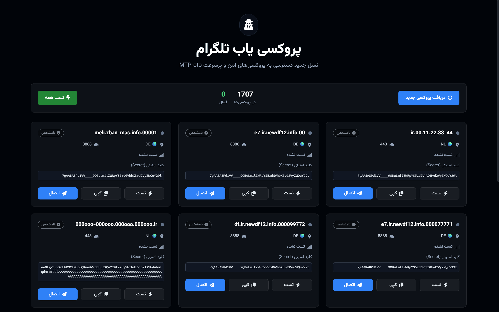

# 🛰 ProxyFinder – پروکسی‌یاب هوشمند تلگرام (نسخه ۱.۱)

🚀 نسل جدید دسترسی به پروکسی‌های امن و پرسرعت MTProto با طراحی حرفه‌ای و امکانات بی‌نظیر – کاملاً **Client-Side** و بدون نیاز به سرور  

---

## 🌐 نسخه آنلاین
👉 [ProxyFinder](https://devartery.github.io/ProxyFinder/proxy.html)

---

## ✨ ویژگی‌ها
- 🌐 اتصال سریع و مستقیم به تلگرام با یک کلیک
- 📡 تست هوشمند پینگ و نمایش کیفیت اتصال (عالی، متوسط، ضعیف)
- 🔁 دریافت لیست جدید پروکسی تنها با یک دکمه
- 🎯 نمایش موقعیت جغرافیایی پروکسی‌ها همراه با پرچم کشور
- 📋 کپی آسان لینک پروکسی و دکمه اتصال مستقیم
- 🧠 رابط کاربری زیبا با انیمیشن و افکت Glow
- 📱 طراحی ریسپانسیو سازگار با موبایل، تبلت و دسکتاپ
- 🎨 ساخته شده با **TailwindCSS** + **FontAwesome** + **Vazirmatn**

---

## 💼 مناسب برای
- 🤓 کاربران حرفه‌ای تلگرام
- 🖥 مدیران کانال‌ها و گروه‌ها
- 📌 صفحات ابزار و خدمات آنلاین
- 👨‍💻 پروژه‌های کاربردی و داشبوردهای وب

---

## 📦 مشخصات فنی
- سورس کامل HTML + CSS + JS
- بدون نیاز به دیتابیس یا بک‌اند
- قابل ادغام با بات‌های تلگرامی و API شخصی
- همه عملیات و پردازش‌ها در مرورگر کاربر (Client-Side)

---

## 🖼 پیش‌نمایش

---

## 📌 نحوه استفاده
1. وارد صفحه وب پروژه شوید (لوکال یا GitHub Pages)  
2. روی **دریافت لیست پروکسی** بزنید  
3. کیفیت پروکسی‌ها را بررسی کنید  
4. با یک کلیک متصل شوید یا لینک را کپی کنید  
5. در صورت نیاز لیست را مجدد رفرش کنید

---

## 🔒 امنیت
- هیچ داده‌ای به هیچ سروری ارسال یا ذخیره نمی‌شود  
- تمام پردازش‌ها و تست‌ها در همان مرورگر شما انجام می‌شود  
- استفاده از روش‌های امن و بدون ردیابی

---

## 🗺 نقشه راه (Roadmap)
- فیلتر پیشرفته بر اساس کشور و پینگ  
- تم‌های تاریک و روشن  
- ذخیره پروکسی‌های منتخب کاربر  
- i18n (چندزبانه)

---

## 🤝 مشارکت
1. ریپو را Fork کنید  
2. Branch جدید بسازید (feat/... یا fix/...)  
3. Commit/Push و PR ثبت کنید

---

## 📬 ارتباط
- 👤 سازنده: [@DevArtery](https://t.me/DevArtery)  
- 📢 کانال تلگرام: [@ownerArtery](https://t.me/ownerArtery)  
